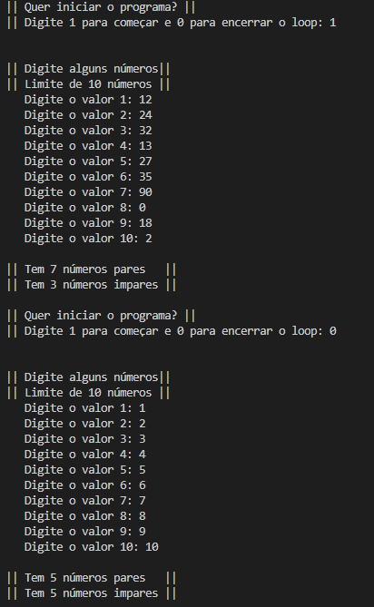
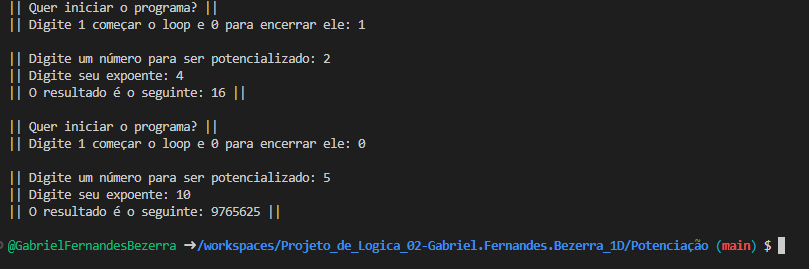

Feito por: Gabriel Fernandes Bezerra

Temas Escolhdos:
**Tabuada**
**Potenciação**
**Contador de Números Pares e Ímpares** (Eu abreviei para **CNPI**)

 **Descrição do Problema & Solução**:

    Os meu maiores problemas foram como entender os Loops, em especial o For que pra mim não fazia sentido, então eu tive que pesquisar em documentações (especialmente naqueles links que Você deixou) e fazer bastante tentativa e erro para entender isso melhor e no fim eu só criei uma função pra servir de tapa buraco para fazer o meu código funcionar certinho, talvez não seja o ideal, mas funcionou muito bem.
    
    Também sofri bastante no Contador de Números Pares e Ímpares porque aquela foi a primeira vez minha usando um array em um Int, então foi meio complicado como descobrir a maneira de armazenar certinho os números na variavel, porém consegui resolver isso com o for de forma levemente tranquila.

    No Contador de Números Pares e Ímpares eu também acabei esquecendo de zerar a variável dos Pares e dos Ímpares, só fui ver esse erro quando tava tirando as prints pra colocar nesse README

**Como Rodar o Projeto e Breve Explicação do Software**

    Teoricammente... é só dar o Gcc e os negócio lá, mas acho bem dificil ser só isso, então eu vou explicar bem brevemente como os códigos funcionam mais ou menos, já que eu acho que os comentários fazem isso muito bem

Contador dos Números Pares e Ímpares
    
    Você digita 10 números e o programa vai te dizer quantos são pares e quantos são ímpares

Potenciação

    Antes de tudo, eu dei uma pesquisada bem interessante nesse, já que eu não sabia como fazer potenciação eu acabei lendo algumas coisinhas para saber como fazer e digo que achei bem interessante a função de colocar outras "Bibliotecas de Código" para adicionar outras possibilidades de código
    Enfim, nesse você tem que digitar o número que você quer potencializar e o seu expoente que o programa fará esse cálculo para você, mostrando-o o resultado

Tabuada

    Você digita um número e o programa mostra a tabuada desse número do Zero (sim eu quis incluir o zero porque é legal) até o Dez

**OBS**: Não Coloque letras de Jeito nenhum nos lugares que pedem números, pois por motivos óbvios, o programa vai bugar completamente

**Prints**
Contador de Números Pares e Ímpares

Tabuada

Potenciação
